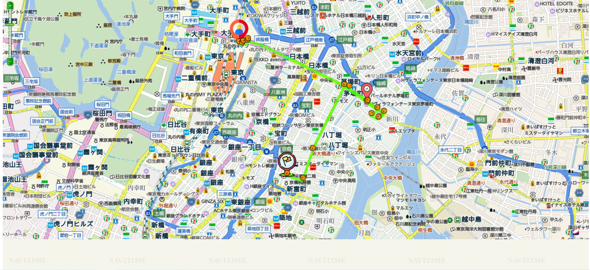
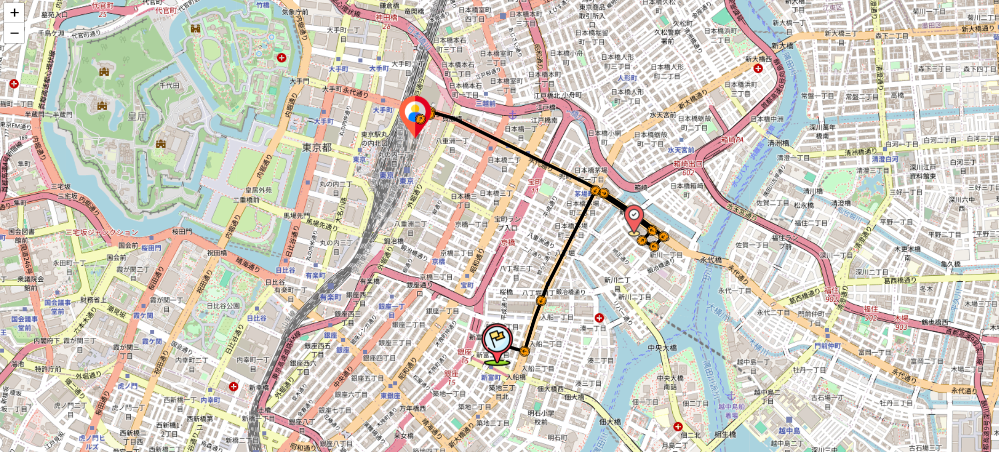

# Free API
Basically the same but with a free limit of 500 API calls every month so anyone can start.

# Rabidapi
I found out that RapidAPI also has NaviTime and comes with a limited number of free requests.

You can register an account on rapidapi.com. Search for the NaviTime API and subscribe to test it.

The free tier allows up to 500 requests per month.

# Trying new API
There are 12 sets of NaviTime APIs that they provide. Due to time constraints, I could only try the car API and map API.

Feel free to test all the APIs available. If you want to complete this project, please create a PR to my repo.

# A little demo of my work
Image of map using NaviTime paid version

Image of map using RapidAPI and leaflet

Peace